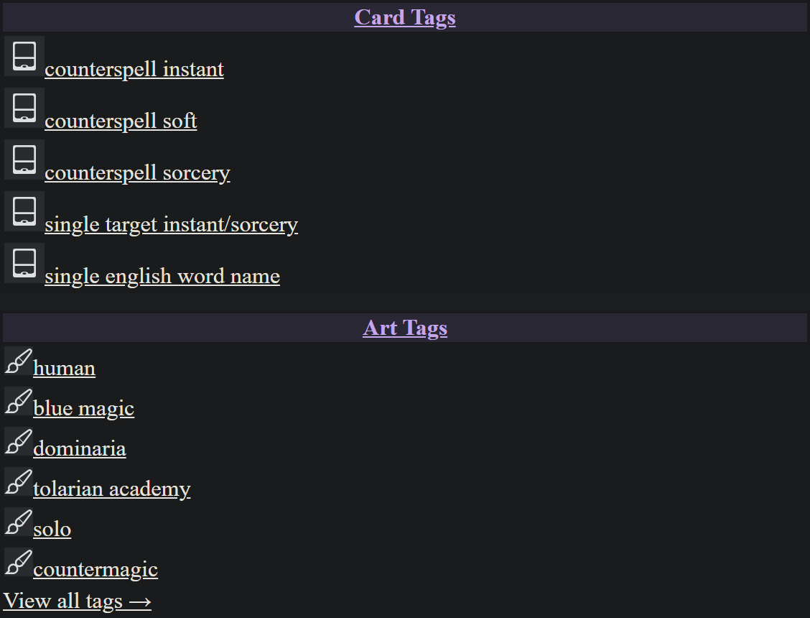
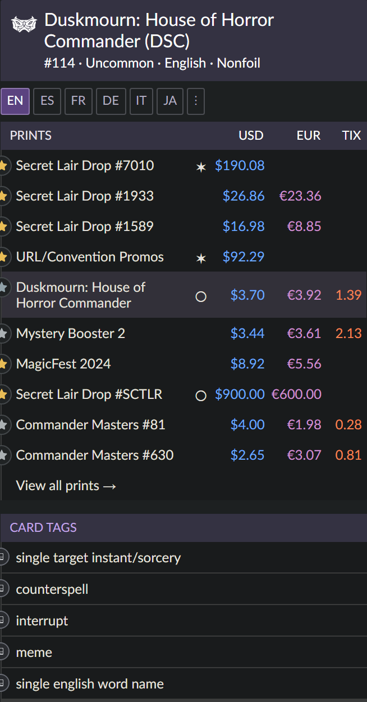
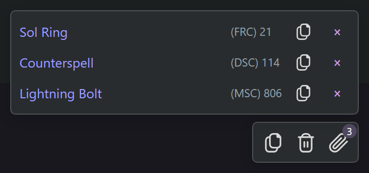
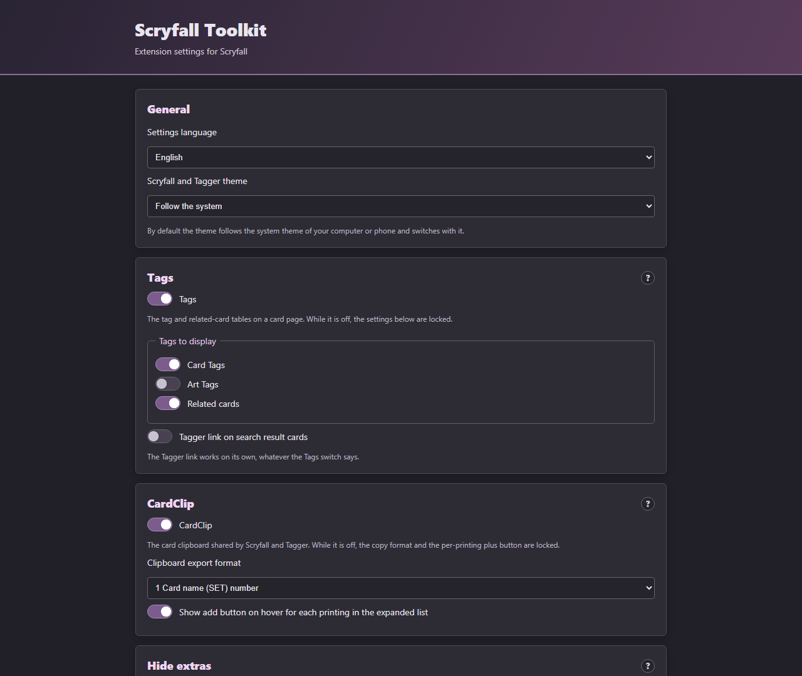

# Scryfall Toolkit

An independent browser extension for **Scryfall** and **Scryfall Tagger**: a shared card clipboard, tag panels on card pages, extra format legalities, a dark theme, and optional EDHREC and CardTrader data.

> **About the dark theme.** It paints over Scryfall's own styles rather than replacing them, so it depends on Scryfall's markup. A page that changes its markup can come out partly unthemed until this extension is updated. Everything else works the same either way.

[Chrome Web Store](https://chromewebstore.google.com/detail/scryfall-toolkit-preview/ofpociogpmmgfjgjnfppnllabhjjnclf) · [Source](https://github.com/Solomag/scryfall-toolkit) · [Releases](https://github.com/Solomag/scryfall-toolkit/releases) · [Changelog](CHANGELOG.md) · [Privacy](PRIVACY.md) · [Third-party notices](THIRD_PARTY_NOTICES.md)

Not produced, endorsed or approved by Scryfall, Wizards of the Coast, EDHREC, CardTrader or Cardmarket.

## What it looks like

Everything below is a real Scryfall card page — their markup, their stylesheet, this
extension's panels on it, in this extension's dark theme. Not a mock-up and not a drawing:
the card is Counterspell and the printings, prices, legalities and tags are the ones
Scryfall and Tagger returned.

**Card and art tags** from Tagger, next to the printings:



**Extra formats** in Scryfall's own legality block — Premodern here is the one this
extension added, from Scryfall's answer about the card:



**The clipboard** in the corner of any page, with per-card copy:



No card artwork appears in any of these pictures, and none ships inside the extension.

## The settings page

The settings page, top to bottom. Every section that changes what a Scryfall page shows
carries a **?** beside its heading: press it and a real Scryfall card page opens over the
settings, with the panel that switch turns on where it sits on the page. Four of the five
are the whole right-hand column — the prints table and the tag tables under it — because
a cut-out of one panel says what it looks like and nothing about where it goes.



## Install

1. Download `scryfall-toolkit-<version>.zip` from the [latest release](https://github.com/Solomag/scryfall-toolkit/releases/latest).
2. Unzip it into a folder you keep.
3. Open `opera://extensions` (or `chrome://extensions`), turn on **Developer mode**, choose **Load unpacked** and pick the unzipped folder — the one that contains `manifest.json`.

To update, replace the contents of that folder and press **Reload** on the extension. Keeping the same folder keeps your clipboard and settings.

To build the archive yourself: `npm run package`. It writes `dist/scryfall-toolkit-<version>.zip` and then reads the archive back, failing if any file a page needs is missing.

## What it does

| | |
| --- | --- |
| **Shared clipboard** | Press `+` on any printing. The list follows you across Scryfall and Tagger, with set codes and collector numbers, and copies as a deck list. An older CardClip clipboard is imported once. |
| **Card and art tags** | Tag panels on a card page, next to the printings. Click a tag to add it to the search box. Related cards from Tagger, with image previews. |
| **Extra format legalities** | Heritage, Classic Legacy, Peak Legacy and Premodern in Scryfall's own legality block, in its own badges. Reorder or hide any row. |
| **Dark theme** | For Scryfall and Tagger. Follows your system until you pick otherwise. |
| **Optional extras** | EDHREC deck usage and Salt Meter, CardTrader prices for the exact printing, finish badges, type and mana search links, set and printing filters, a No Prices mode, a token list and a Commander legality check on deck pages. EDHREC and CardTrader are off until you turn them on; the rest have their own defaults and each can be switched off. |
| **In the deck editor** | Three more tools, **all off by default**: a Clean Up button that sorts the deck and puts lands back in their column, EDHREC's suggestions for this deck and commander, and a Scryfall search that adds cards without leaving the editor. These run through Scryfall's own application state rather than the page markup, which is why they are opt-in. |

Everything each one does, in detail: **[docs/FEATURES.md](docs/FEATURES.md)**.

## Settings

The toolbar button opens a small popup with the five switches you reach for most — theme, tags, clipboard, EDHREC, CardTrader — and a button to the full page.

| Section | What is in it |
| --- | --- |
| **General** | Settings language — which also sets the language of the controls the extension adds to Scryfall and Tagger — and theme |
| **Tags** | Card/art tags, related cards, the Tagger link on search results |
| **CardClip** | The clipboard, the copy format, the per-printing `+` |
| **Visibility** | two columns: on the left a table with one row per platform — Paper, Arena, Magic Online — and a column per place: the platform's own **Show** box and its own boxes for the **Prints table**, **Search** and **Sets list**, with the Caster marker on its own under the table; and on the right, prices (USD, TIX, EUR), store links (TCGplayer, Cardhoarder, Cardmarket) under a switch for the whole **Buy This Card** block, CardTrader offers, and the EUR price source. Everything ticked means shown, and turning a platform — or the store block — off keeps the choices under it and brings them back; the **EUR** box and the EUR-source dropdown are two views of the same column, kept in step |
| **Additional info** | A list of one-line features, each with its own switch and its settings behind a **Set up** button: the finish column, type and mana search, Commander popularity and Salt Meter |
| **Legality** | The extra formats and their order |
| **Scryfall Deckbuilder** | A list of one-line features, each with its own switch and a **?** for what it does and what it does not: No Prices, the token list, stacked cards, a per-card Commander check, EDHREC suggestions, deck search, and the improved cleanup — whose settings are behind its own **Set up**, collapsed until asked for |
| **Diagnostics** | The deck modules' own report, collapsed at the bottom of the page: whether a suitable editor page has been checked, whether the modules attached, and the technical detail behind it |

## FAQ

**[docs/FAQ.md](docs/FAQ.md)** covers the questions that come up: where the data comes from, what is sent where, how the CardTrader token is handled, why some sets stay visible, and what to do when something looks wrong.

## Privacy, in one paragraph

Settings and the clipboard live in `chrome.storage.local` and never leave your browser. There is no account, no analytics and no server of ours. The extension asks Scryfall, Scryfall Tagger, EDHREC and CardTrader for data because that is where the features come from; EDHREC and CardTrader are off until you enable them. Full detail, request by request: **[PRIVACY.md](PRIVACY.md)**.

## Development

```
npm install     # linkedom, for the tests
npm test        # nine suites
npm run render  # draw every panel in Chrome and measure it
npm run package # build the release archive
```

The last suite is a smoke test of the package: it builds the archive, unpacks it and turns it on. Two earlier releases shipped with a file missing from the zip while the working folder was fine, which is what that suite exists to stop.

**`npm run render` is not in `npm test`, because Chrome is not something a test suite may assume.** It builds all six card-page panels and both deck panels the way the extension builds them, from Scryfall's own markup and stylesheet with our theme on top, and measures them in a real browser at four widths from 1600px down to a phone: 208 card-page checks and 202 deck-page checks about containment, overlap, size, overflow and legibility. The suites run on linkedom, which is an HTML parser with no layout and no CSS, so everything they can say about a panel is about the DOM. `npm run mutations` breaks thirteen things on purpose and fails if any of them goes unnoticed, which is how a check that cannot fail is found.

**Before a release, run the live pass.** The suites check repository invariants — that the archive holds what the pages reference, that the version is written everywhere it is shown, that no host is used without being declared, and that the documents do not contradict each other. None of that can see Scryfall, and Scryfall can change its markup or its application internals with no deprecation cycle. **[docs/RELEASE_CHECKLIST.md](docs/RELEASE_CHECKLIST.md)** is the ten minutes of browser work that closes that gap, and it lists the limits that are known rather than defects.

**Release archives are built by CI**, from the tag, on a runner anyone can name. The workflow prints the SHA-256 of the file it publishes, so the bytes on the release page can be tied to a commit and a runner. A zip built locally is for trying things out.

Source code: <https://github.com/Solomag/scryfall-toolkit>

## License and third-party notices

This project's own code is **MPL-2.0** — see [`LICENSE`](LICENSE) for the full official text.

Material from other projects keeps its own licence and its own notice. The MPL covers none of it and grants no rights in anyone's trademarks:

| Files | Terms |
| --- | --- |
| `assets/data/oracle-tags.js`, `assets/data/illustration-tags-1.js`, `assets/data/illustration-tags-2.js` | MoxTags v1.8.3 data — MIT, © 2026 Nate Finch |
| `assets/icons/clip.svg`, `assets/icons/duplicate.svg`, `assets/icons/trash.svg` | CardClip icons — MIT, © 2022 Jacob Hearst |
| `assets/icons/cardtrader.svg`, `assets/icons/cardtrader.png` | Third-party brand marks, **not covered by any licence of this project**. No permission was requested from those services and none was received; they ship on the basis set out in `THIRD_PARTY_NOTICES.md` — the mark says whose data is on screen, is never altered, and sits on a control that already carries the name in words. |
| `assets/icons/cardmarket-white.png` | **Cardmarket's symbol**, cropped out of the logo file they publish for download and used on their terms. Drawn as a mask, so the shape is theirs and the colour is the heading's own ink. Their rights stay theirs and the goodwill from use is theirs; `THIRD_PARTY_NOTICES.md` quotes the terms and says what is done to stay inside them. |
| `manifest.json`, `package.json`, and everything under `src/` and `assets/` that is not listed above | MPL-2.0 |

Full detail, source by source: **[THIRD_PARTY_NOTICES.md](THIRD_PARTY_NOTICES.md)**. Licence texts are in [`assets/licences/`](assets/licences/) and ship inside the extension archive.

The current version is in the [releases](https://github.com/Solomag/scryfall-toolkit/releases) and in the `manifest.json` inside the archive. The store link's "preview" is that listing's own slug, not a claim about this project.

Limitations and what is still open: **[docs/FEATURES.md](docs/FEATURES.md)** and **[docs/FAQ.md](docs/FAQ.md)**. What is deliberately not being worked on right now: **[docs/ROADMAP.md](docs/ROADMAP.md)**.
