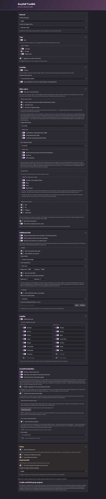

# Scryfall Toolkit 0.60.0

An independent browser extension for **Scryfall** and **Scryfall Tagger**: a shared card clipboard, tag panels on card pages, extra format legalities, a dark theme, and optional EDHREC and CardTrader data.

> **About the dark theme.** It paints over Scryfall's own styles rather than replacing them, so it depends on Scryfall's markup. A page that changes its markup can come out partly unthemed until this extension is updated. Everything else works the same either way.

[Chrome Web Store](https://chromewebstore.google.com/detail/scryfall-toolkit-preview/ofpociogpmmgfjgjnfppnllabhjjnclf) · [Source](https://github.com/Solomag/scryfall-toolkit) · [Releases](https://github.com/Solomag/scryfall-toolkit/releases) · [Changelog](CHANGELOG.md) · [Privacy](PRIVACY.md) · [Third-party notices](THIRD_PARTY_NOTICES.md)

Not produced, endorsed or approved by Scryfall, Wizards of the Coast, EDHREC, CardTrader or Cardmarket.

## What it looks like

The whole settings page, top to bottom. Each section that changes what a Scryfall page
shows carries a picture of it, taken from the feature files themselves — so what you see
beside a switch is the panel the switch turns on, not a drawing of one:



## Install

1. Download `scryfall-toolkit-<version>.zip` from the [latest release](https://github.com/Solomag/scryfall-toolkit/releases/latest).
2. Unzip it into a folder you keep.
3. Open `opera://extensions` (or `chrome://extensions`), turn on **Developer mode**, choose **Load unpacked** and pick the unzipped folder — the one that contains `manifest.json`.

To update, replace the contents of that folder and press **Reload** on the extension. Keeping the same folder keeps your clipboard and settings.

To build the archive yourself: `npm run package`. It writes `dist/scryfall-toolkit-<version>.zip` and then reads the archive back, failing if any file a page needs is missing.

## What it does

| | |
| --- | --- |
| **Shared clipboard** | Press `+` on any printing. The list follows you across Scryfall and Tagger, with set codes and collector numbers, and copies as a deck list. An older CardClip clipboard is imported once. |
| **Card and art tags** | Tag panels on a card page, next to the printings. Click a tag to add it to the search box. Related cards from Tagger, with image previews. |
| **Extra format legalities** | Heritage, Classic Legacy, Peak Legacy and Premodern in Scryfall's own legality block, in its own badges. Reorder or hide any row. |
| **Dark theme** | For Scryfall and Tagger. Follows your system until you pick otherwise. |
| **Optional extras** | EDHREC deck usage and Salt Meter, CardTrader prices for the exact printing, finish badges, card nicknames, type and mana search links, set and printing filters, a No Prices mode, a token list on deck pages. EDHREC and CardTrader are off until you turn them on; the rest have their own defaults and each can be switched off. |
| **In the deck editor** | Three more tools, **all off by default**: a Clean Up button that sorts the deck and puts lands back in their column, EDHREC's suggestions for this deck and commander, and a Scryfall search that adds cards without leaving the editor. These run through Scryfall's own application state rather than the page markup, which is why they are opt-in. |

Everything each one does, in detail: **[docs/FEATURES.md](docs/FEATURES.md)**.

## Settings

The toolbar button opens a small popup with the five switches you reach for most — theme, tags, clipboard, EDHREC, CardTrader — and a button to the full page.

| Section | What is in it |
| --- | --- |
| **General** | Settings language, theme |
| **Tags** | Card/art tags, related cards, the Tagger link on search results |
| **CardClip** | The clipboard, the copy format, the per-printing `+` |
| **Prints** | Grouping printings by set, folding groups, the full-list link |
| **Hide extras** | Caster indicator, set and price filters, the platform filter |
| **Additional info** | Finish column, type and mana search, nicknames, EDHREC, CardTrader |
| **Legality** | The extra formats and their order |
| **Scryfall Deckbuilder** | No Prices, stacked cards, the token list, and the three opt-in tools above |
| **Experimental** | Settings still being worked on |

## FAQ

**[docs/FAQ.md](docs/FAQ.md)** covers the questions that come up: where the data comes from, what is sent where, how the CardTrader token is handled, why some sets stay visible, and what to do when something looks wrong.

## Privacy, in one paragraph

Settings and the clipboard live in `chrome.storage.local` and never leave your browser. There is no account, no analytics and no server of ours. The extension asks Scryfall, Scryfall Tagger, EDHREC and CardTrader for data because that is where the features come from; EDHREC and CardTrader are off until you enable them. Full detail, request by request: **[PRIVACY.md](PRIVACY.md)**.

## Development

```
npm install     # linkedom, for the tests
npm test        # six suites
npm run package # build the release archive
```

The last suite is a smoke test of the package: it builds the archive, unpacks it and turns it on. Two earlier releases shipped with a file missing from the zip while the working folder was fine, which is what that suite exists to stop.

**Release archives are built by CI**, from the tag, on a runner anyone can name. The workflow prints the SHA-256 of the file it publishes, so the bytes on the release page can be tied to a commit and a runner. A zip built locally is for trying things out.

Source code: <https://github.com/Solomag/scryfall-toolkit>

## License and third-party notices

This project's own code is **MPL-2.0** — see [`LICENSE`](LICENSE) for the full official text.

Material from other projects keeps its own licence and its own notice. The MPL covers none of it and grants no rights in anyone's trademarks:

| Files | Terms |
| --- | --- |
| `assets/data/oracle-tags.js`, `assets/data/illustration-tags-1.js`, `assets/data/illustration-tags-2.js` | MoxTags v1.8.3 data — MIT, © 2026 Nate Finch |
| `assets/data/shambleshark-nicknames.js` | Shambleshark nickname records — MIT, © 2016 Samuel Simões, © 2019 Blade Barringer |
| `assets/icons/clip.svg`, `assets/icons/duplicate.svg`, `assets/icons/trash.svg` | CardClip icons — MIT, © 2022 Jacob Hearst |
| `assets/icons/edhrec.png`, `assets/icons/cardtrader.svg`, `assets/icons/cardtrader.png` | Third-party brand marks. **Not covered by any licence of this project**, and not cleared: no permission was requested from those services and none was received. |
| `assets/icons/cardmarket-white.png` | **Cardmarket's symbol**, cropped out of the logo file they publish for download and used on their terms. Drawn as a mask, so the shape is theirs and the colour is the heading's own ink. Their rights stay theirs and the goodwill from use is theirs; `THIRD_PARTY_NOTICES.md` quotes the terms and says what is done to stay inside them. |
| `manifest.json`, `package.json`, `src/card-page/core.js`, `content-*.js` and the rest of this project's own files | MPL-2.0 |

Full detail, source by source: **[THIRD_PARTY_NOTICES.md](THIRD_PARTY_NOTICES.md)**. Licence texts are in [`assets/licences/`](assets/licences/) and ship inside the extension archive.

Limitations and what is still open: **[docs/FEATURES.md](docs/FEATURES.md)** and **[docs/FAQ.md](docs/FAQ.md)**. What is deliberately not being worked on right now: **[docs/ROADMAP.md](docs/ROADMAP.md)**.
